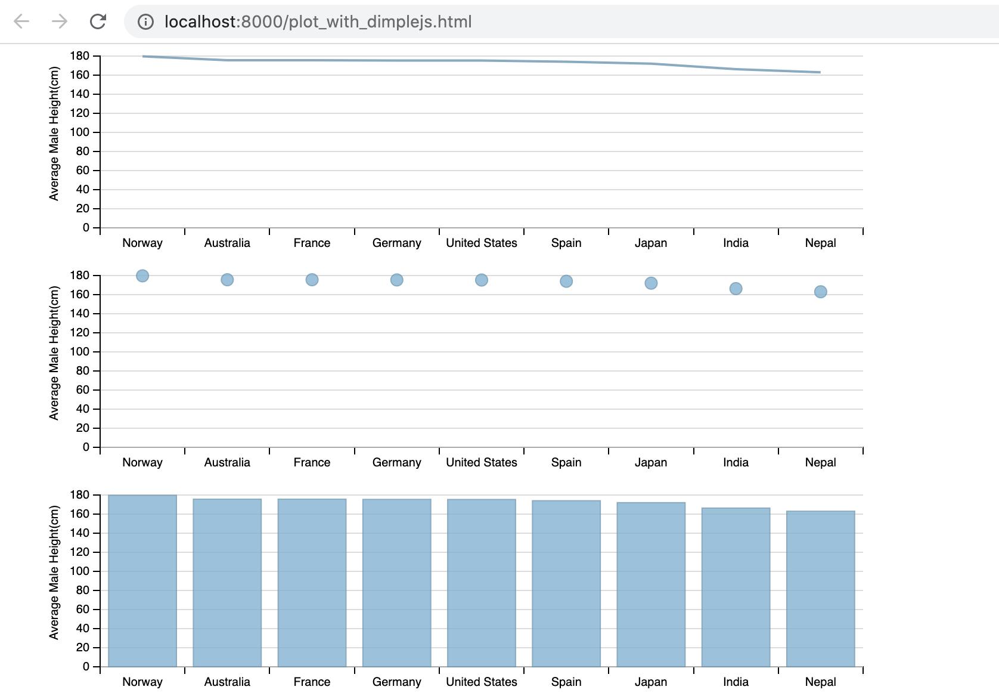

## PLOT WITH DIMPLE.JS

Build line, bubble and bar charts from csv data using dimple.js, an abstraction library over d3.js

#### USAGE
You need a web server running locally. 
You can start a simple Python-based web server using http.server on the same directory as this source code.
```console
➜  plot-with-dimplejs git:(master) ✗ python3 -m http.server 8000
Serving HTTP on 0.0.0.0 port 8000 (http://0.0.0.0:8000/) ...
```

Then go to 'http://localhost:8000/plot_with_dimplejs.html'

#### SCREENSHOT
